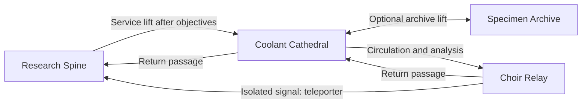

# The lower decks

Three original sectors extend the existing seven-level campaign. Keep exploration self-directed: room names, distinct spaces, physical locks and the existing sound/display responses carry progression. No objective arrows or extra tutorial overlays were added.

## Campaign access

Complete Research Spine's existing objectives, then use the new lift in its eastern service passage with E. Existing saves can access it on the next level load. The original lab/triage routes remain available.



The new endpoint reconnects to the ship; this slice does not add a campaign victory screen. Archive supplies are a voluntary reward, and the main route never requires visiting the archive.

## Scenario design and walkthrough spoilers

### Coolant Cathedral — circulation and a return shortcut

A teal industrial ring surrounds a sealed living coolant chamber. Search the intake for the service card, collect a sample on the condenser walk, and bring the eastern pump online. Restoring circulation releases the western shortcut and core access. Analyze the coolant to open the onward route to Choir Relay. The archive service lift is an optional branch from the intake.

Two terminals change the sector's progression. The pump raises pressure from one spawn attempt per 7.5 seconds to 5.5; analysis lowers it to 4.5. A supply console and scattered rounds support the longer loop. The dynamic enemy cap remains four.

### Specimen Archive — a voluntary supply expedition

A cold blue archive with a compact amber reserve. The receiving room opens onto a central aisle; the index card is in the southern cold store. Recover the catalog in the northwestern vault to release the northern specimen room and a shortcut back to receiving. A sample from the index vault can be identified in the specimen room for ammunition and healing. The separate reserve card opens an additional supply console quietly. Its worn steel door can also be breached at an ammunition and combat cost (see below).

The return passage is available from arrival. Neither archive objective gates the main campaign. The reserve's card is separate from the index card. The alternative is deliberately costly forced entry.

### Choir Relay — two independent wings and an active return

A violet cable transept joins the ground-return and phase wings. Their consoles can be activated in either order; each wing holds one biological sample. Both consoles are needed to release the central field. Analyze the signal organism with two samples to enable the return teleporter to Research Spine.

Pressure increases from 8 seconds to 5 after the first console and 2.8 after isolation. This is an activation-and-return scenario, not a timed survival mission. Supply rooms, two wing ammunition pickups and a med-gel pickup support the return. The player can also retreat to Coolant Cathedral.

## Persistence and validation

Doors, pickups, terminal states and objectives use the existing per-level save state. Spawn pressure is now reconstructed from activated terminal actions on load/revisit; reward actions are not replayed. This also restores the intended pressure of earlier sectors. No save schema change is required.

`scenario_tests.rs` checks actual wall cuts with a 22-unit player radius, staged keys/objectives, both relay orders, optional reserve access, Research Spine's new connection and spawn-pressure restoration. Existing art/spawn checks cover all seven sectors. Content validation checks every campaign route and entry id.

```sh
cargo test -p game_core -p euther_game --offline
cargo run -p euther_game -- --validate-content
cargo run -p euther_game -- --visual-smoke /tmp/eutherbreed-coolant-check --visual-level coolant_cathedral
```

The last command is an automated overview, not normal play; it uses an isolated save, captures doors and follows one of the selected level's actual exits. Normal play starts with `scripts/run.sh`.

## Local source research

Inspected local OpenBreed checkout `fac5b440` and the existing `/home/nichlas/AlienBrT/TA.EPF` archive on 2026-09-19. No original game source tree was identified in AlienBrT: it contains executable files and packed resources. OpenBreed is a separate reimplementation/reference.

- `OpenBreed/data/Vanilla/ABTA/Scripts/Common/Door.lua`: inventory requirement checks, one-time opening state, animation completion before removing the obstacle. This supports physical gated routes and persistent opened-state design.
- `OpenBreed/data/Vanilla/ABTA/Scripts/Common/Pickables/Keycard.lua` and `data/Vanilla/GameDatabase.ABTA.EPF.xml`: collectible keycards and several colored variants; inspiration for separate service/index/reserve access rather than one universal key.
- `OpenBreed/data/Vanilla/ABTA/Scripts/Common/Teleporter.lua`: paused transition, camera fade, moving the actor to the paired exit, then resume/fade-in. Inspiration for the relay's return connection using EutherBreed's existing transitions.
- `OpenBreed/data/Vanilla/ABTA/Scripts/L1/MAP.01.lua`: a mission-start hook with delayed speech; evidence for event-driven atmosphere, not an implemented mission catalog.
- `OpenBreed/src/OpenBreed.Reader.Legacy/Maps/MAP/MAPReader.cs`: separate map blocks including `BODY`, `MISS`, `MTXT`, `LCTX` and notes. `MISS` names time, exit-code and monster fields but still labels many values unknown; their exact semantics need further verification before implementing a faithful decoder.
- Existing `abta_tools` heuristic directory listing identifies 55 entries named `MAP.01` through `MAP.55`. This verifies a substantial local map corpus, not 55 decoded scenario scripts.

No reference maps, source code, textures, sound samples or original story text were imported. New layouts and encounters are authored in EutherBreed RON content with its existing art/audio.

Useful future research: decode mission metadata into a local-only summary; investigate alarm-triggered waves, power-dependent machinery and alternate exits. A timed evacuation, destructible machinery or distinct enemy archetypes would require gameplay work beyond this content slice.


## Breachable bulkheads (2026-09-19 continuation)

OpenBreed's `Door.lua` also has a `DestroyDoor` path: replace the door stamp, remove its blocking bodies and emit an explosion. EutherBreed now has an original, opt-in version of this mechanic. The two-host response is our scenario design, not a claim that the original door script summons enemies.

The archive's **reserve_gate** is weakened steel. Rust-colored fractures distinguish it without a text prompt or health bar. Ten reagent-round hits shatter it, scatter animated fragments, leave torn edges and wake two named enemies in the central aisle. The reserve keycard still opens it normally and does not trigger the attack. Main objective barriers remain intact; content validation rejects breach configurations on energy fields or objective-gated doors.

Partial damage is saved in the defaulted `LevelState.door_damage` map; previous saves remain readable. A breach also saves the open state. Ambush hosts use stable `breach:<door-id>:<index>` ids and existing killed-enemy state. Surviving hosts return on reload; killed ones stay dead. Reloading never adds a second wave or replays the rupture sound.

Content authors can add `breach: Some((hits: 10, alarm_spawns: [(x, y), ...]))` to a bulkhead definition. At most four alarm positions are allowed, with floor and obstacle clearance. The editor preserves this data and shows it in the inspector; converting a door into an energy field or assigning an objective gate removes the incompatible breach configuration. Direct breach authoring currently uses RON.

Projectile collision now sweeps the complete movement segment against the nearest wall. This prevents shots crossing thin doors at low frame rates or damaging a door behind another wall. Firing, movement and enemy-hit resolution have an explicit order.

Original metal impact and rupture sounds: `assets/audio/bulkhead-impact.ogg` and `bulkhead-breach.ogg`. Both obey the SFX slider and can be regenerated with `scripts/generate-breach-audio.py` (NumPy/ffmpeg).

Graphical regression check, using an isolated save:

```sh
cargo run -p euther_game -- --visual-smoke /tmp/eutherbreed-breach-check --visual-level specimen_archive --breach-review
```

It fires four rounds, saves/loads partial damage, finishes the breach, checks the removed obstacle and two hosts, then saves/loads one killed host and checks that only the survivor returns. Screenshots cover intact, damaged, breached and restored states.
